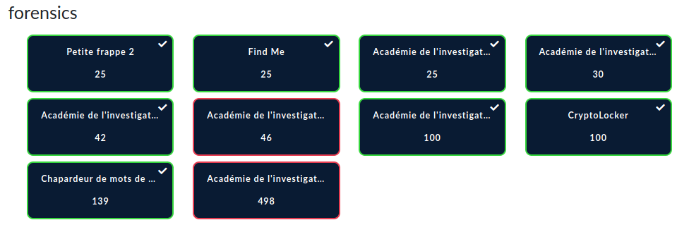

#  Présélection du France Cybersecurity Challenge (FCSC) 2020

Ce répertoire contient les writeups de la catégorie forensic résolus lors de la phase de préqualification du FCSC 2020.

## Liste des challenges

* [C'est la rentrée](./Academie_de_l_investigation/C_est_la_rentree.md)
* [Premiers artéfacts](./Academie_de_l_investigation/Premiers_artefacts.md) 
* [Porte dérobée](./Academie_de_l_investigation/porte_derobee.md) 
* Rédaction
* Administration

# Challenges résolus : 

> Note : Les challenge "administration" a malheureusement était résolu trop tard lors du dernier jour du CTF...