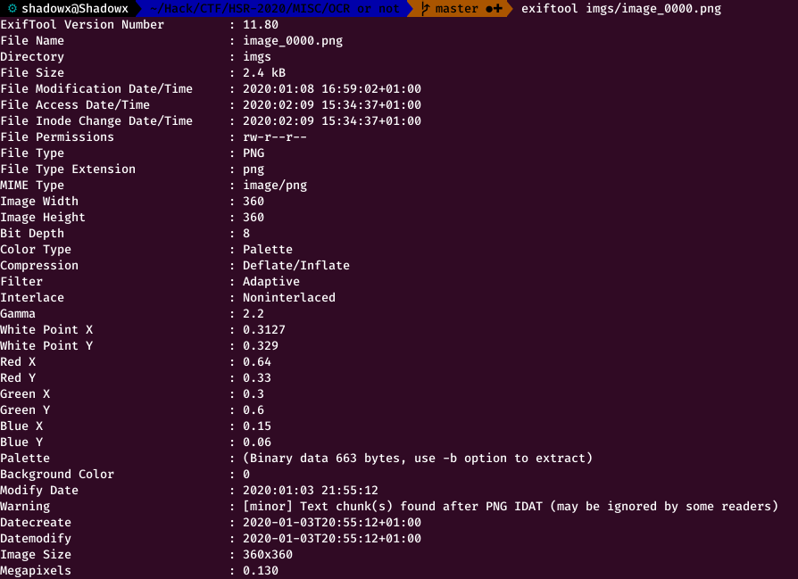

# OCR or not !!! (175 points)

This challenge provides a zip archive in which a large amount of images are stored.

Each of these images contains a letter : 


# The wrong way 

Although the title of this MISC challenge is very clear, I first tried to resolve this challenge via OCR. 

```python 
import pytesseract
import cv2

import os


from PIL import Image


res = ''

for file in sorted(os.listdir('./imgs/')):

    print(file)

    image_file = Image.open('./imgs/' + file)  # open colour image
    image_file = image_file.convert('1')  # convert image to black and white


    #img = cv2.imread(image_file)


    r = pytesseract.image_to_string(image_file, config="-c tessedit"
                                            "_char_whitelist=abcdefghijklmnopqrstuvwxyzABCDEFGHIJKLMNOPQRSTUVWXYZ0123456789="
                                            " --psm 10"
                                            " -l osd"
                                            " ")
    res = res + r

f = open("res.txt", "a")
f.write(res)
f.close()

```

Despite several attempts I could not solve this challenge with to Tesseract which seems to have difficulties when the image contains only one character.

So I analyzed the problem from another perspective!

## The Hashes solution

We can see that the last image has the equal sign, so we can expect to find a base64 encoded message! 

So the images can only contain the following characters: A-Z a-z 0-9 + =

But do we have the information in the exif data ?



Nice try! But nope...


So we need to find a way to differentiate all the images. So let's use file hashes!

I do a manual mapping between the hashes and their corresponding characters :

```python
# Loop over each images
for file in sorted(os.listdir(imgs_path)):

    target = imgs_path + '/' + file

    # Retrieve MD5 hash of the file
    m = md5(target)

    # If the hash is discovered for the first time, we associate it with the character contained in the image
    if m not in hashs:

        plt.imshow(
            mpimg.imread(target)
        )
        plt.show()
        char = input('Char in file ? : ')
        hashs[m] = char

```

Notice that I've used matplotlib to display the image interactively.

Now we have a mapping. We can loop one more time to get the expected base 64 : 

```python
# Loop for the last time over each images
b64_flag = ''
for file in sorted(os.listdir(imgs_path)):

    target = imgs_path + '/' + file
    # Retrieve MD5 hash of the file
    m = md5(target)

    # Retrieve char associated with the char
    b64_flag = b64_flag + hashs.get(m)

# print the base64 flag
print(b64_flag)

# print reversed flag :
print(
    base64.b64decode(b64_flag)
)

```


# Let the magic happen 


Well after the execution we got a base64 string :

```
SW1hZ2VNYWdpY2sgd2FzIGNyZWF0ZWQgaW4gMTk4NyBieSBKb2huIENyaXN0eSB3aGVuIHdvcmtpbmcgYXQgRHVQb250LCB0byBjb252ZXJ0IDI0LWJpdCBpbWFnZXMgKDE2IG1pbGxpb24gY29sb3JzKSB0byA4LWJpdCBpbWFnZXMgKDI1NiBjb2xvcnMpLCBzbyB0aGV5IGNvdWxkIGJlIGRpc3BsYXllZCBvbiBtb3N0IHNjcmVlbnMuIEl0IHdhcyBmcmVlbHkgcmVsZWFzZWQgaW4gMTk5MCB3aGVuIER1UG9udCBhZ3JlZWQgdG8gdHJhbnNmZXIgY29weXJpZ2h0IHRvIEltYWdlTWFnaWNrIFN0dWRpbyBMTEMsIHN0aWxsIGN1cnJlbnRseSB0aGUgcHJvamVjdCBtYWludGFpbmVyIG9yZ2FuaXphdGlvbi4KCkluIE1heSAyMDE2LCBpdCB3YXMgcmVwb3J0ZWQgdGhhdCBJbWFnZU1hZ2ljayBoYWQgYSB2dWxuZXJhYmlsaXR5IHRocm91Z2ggd2hpY2ggYW4gYXR0YWNrZXIgY2FuIGV4ZWN1dGUgYXJiaXRyYXJ5IGNvZGUgb24gc2VydmVycyB0aGF0IHVzZSB0aGUgYXBwbGljYXRpb24gdG8gZWRpdCB1c2VyLXVwbG9hZGVkIGltYWdlcy4gU2VjdXJpdHkgZXhwZXJ0cyBpbmNsdWRpbmcgQ2xvdWRGbGFyZSByZXNlYXJjaGVycyBvYnNlcnZlZCBhY3R1YWwgdXNlIG9mIHRoZSB2dWxuZXJhYmlsaXR5IGluIGFjdGl2ZSBoYWNraW5nIGF0dGVtcHRzLiBIU1J7MW1hZzFja18xc19BX2dyM2F0X3QwMGx9IC4gVGhlIHNlY3VyaXR5IGZsYXcgd2FzIGR1ZSB0byBJbWFnZU1hZ2ljayBjYWxsaW5nIGJhY2tlbmQgdG9vbHMgd2l0aG91dCBmaXJzdCBwcm9wZXJseSBjaGVja2luZyB0byBlbnN1cmUgcGF0aCBhbmQgZmlsZSBuYW1lcyBhcmUgZnJlZSBvZiBpbXByb3BlciBzaGVsbCBjb21tYW5kcy4gVGhlIHZ1bG5lcmFiaWxpdHkgZGlkIG5vdCBhZmZlY3QgSW1hZ2VNYWdpY2sgZGlzdHJpYnV0aW9ucyB0aGF0IGluY2x1ZGVkIGEgcHJvcGVybHkgY29uZmlndXJlZCBzZWN1cml0eSBwb2xpY3kuCg==
```


As mentioned above, the chain had to be a base64. Let's change the encoding! 

We obtain the following text : 

> ImageMagick was created in 1987 by John Cristy when working at DuPont, to convert 24-bit images (16 million colors) to 8-bit images (256 colors), so they could be displayed on most screens. It was freely released in 1990 when DuPont agreed to transfer copyright to ImageMagick Studio LLC, still currently the project maintainer organization.

> In May 2016, it was reported that ImageMagick had a vulnerability through which an attacker can execute arbitrary code on servers that use the application to edit user-uploaded images. Security experts including CloudFlare researchers observed actual use of the vulnerability in active hacking attempts. HSR{1mag1ck_1s_A_gr3at_t00l} . The security flaw was due to ImageMagick calling backend tools without first properly checking to ensure path and file names are free of improper shell commands. The vulnerability did not affect ImageMagick distributions that included a properly configured security policy.


** And voila ! We got the flag : HSR{1mag1ck_1s_A_gr3at_t00l}**


Thanks to [makhno](https://twitter.com/m4khno_) for this challenge ;)